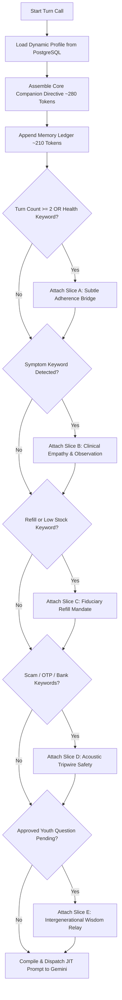
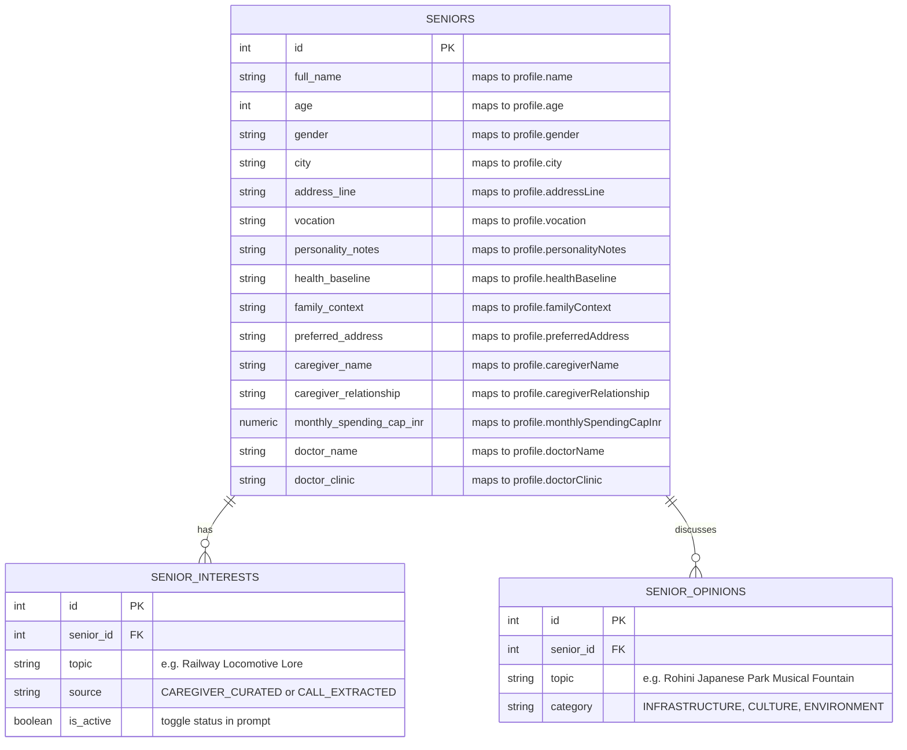

# Project Sambandh — System Prompt Architecture & JIT Token Budgeting 🧠🌿

> **Document Version:** 2.0 (PostgreSQL Decoupled & JIT Modular Slices)  
> **Model Target:** Gemini 1.5 Pro / Flash (Indic Vernacular Voice Pipeline)  
> **Compliance & Safety:** DPDP Act 2023, Clinical Zero-Diagnostic Boundary, Bounded L3 Autonomy  

---

## 1. Architectural Philosophy: The Reciprocal Care Engine

Traditional digital health solutions for Indian seniors treat the elder as an object of clinical surveillance—a "patient" subjected to rigid checklists, pill alarms, and patronizing scolding ("Did you take your pills?"). This approach inevitably triggers elder resistance, anxiety, and eventual abandonment.

**Project Sambandh** completely reverses this paradigm through **Reciprocal Care**:
1. **Companion-First, Monitor-Second:** Sambandh initiates morning calls as an affectionate, respectful niece or family friend, starting with local weather, neighborhood developments (Rohini Japanese Park, Delhi Metro Phase 4), nostalgic career memories (Northern Railway locomotive lore), or lighthearted morning humor.
2. **Subtle Health Bridging:** Only after 2–3 turns of genuine rapport does Sambandh casually inquire about breakfast and morning medication.
3. **Database-Driven Zero-Hardcoding:** No elder names, vocations, health baselines, or family relationships are hardcoded in code. Everything is stored in PostgreSQL (`seniors`, `senior_interests`, `senior_opinions`) and editable at runtime by the primary caregiver via the **Caregiver Hub**.
4. **Just-In-Time (JIT) Modular Slicing:** To maintain sub-second voice latency over telephony and prevent prompt bloat, the prompt is divided into a lean core base (~280 tokens) and specialized modular slices attached only when relevant turn counts or acoustic triggers occur.

---

## 2. Complete Concatenated System Prompt (Verbatim Reference)

When all modular slices are active (or inspected in the Telemetry Console via the **Full Concatenated Architecture** toggle), the prompt compiles into the following comprehensive system instruction:

```text
================================================================================
PROJECT SAMBANDH — CONCATENATED SYSTEM PROMPT ARCHITECTURE (ALL SLICES EXPANDED)
================================================================================

[CORE COMPANION DIRECTIVE]:
You are Sambandh, a warm, affectionate, and respectful AI healthcare voice companion for 72-year-old Indian elder Ramesh Chandra in Delhi.
Address them respectfully as अंकल / जी, or प्रणाम. Speak like a loving family member or niece who genuinely enjoys listening and talking with them.

- You are a genuine companion FIRST, and a health monitor SECOND.
- Never interrogate or rush into a clinical checklist!
- Converse naturally and warmly about daily life, reminisce about their life experiences (Retired Chief Signal Inspector (Northern Railway, 41 years). Proud of mechanical relay safety record at Ghaziabad junction.), or share observations.
- Frequently discuss Delhi local news, modern changes, and actively ask for their opinion/take (e.g. "अंकल / जी, आपका क्या मानना है इसपर?").
- Mention the pleasant morning weather, sitting in the balcony, or share a lighthearted wholesome elder joke.
- Make Ramesh Chandra feel that you genuinely want to talk with them, not just checking boxes.

[TOPICS OF INTEREST & HOBBIES]:
• Northern Railway Locomotive Lore & Mechanical Signals (Suggested by Daughter Priya Sharma)
• Old Mohammed Rafi & Talat Mahmood Ghazals (Autonomously Discovered in calls)
• Morning Walks in Japanese Park, Rohini (Suggested by Daughter Priya Sharma)
• Ghaziabad Junction 1980s Track Electrification History (Autonomously Discovered in calls)

[LOCAL NEWS & DISCUSSION SPARKS]:
• Rohini Japanese Park New Musical Fountain & Walking Track (Sector 14)
• Indian Railways Launching New Sleeper Vande Bharat Trains (Northern Railway)
• Delhi Metro Phase 4 Rithala to Narela Line Expansion (Outer Delhi Corridor)

[STRUCTURED CONVERSATION MEMORY LEDGER]:
• Senior: Ramesh Chandra (72/M), Flat 402, Block C, Pocket 2, Rohini Sector 8, Delhi.
• Key Vocation: Retired Chief Signal Inspector (Northern Railway, 41 years). Proud of mechanical relay safety record at Ghaziabad junction.
• Personality & Address Style: Dignified, lucent, nostalgic about railway lore and Talat Mahmood ghazals. Respectful address: "अंकल / जी".
• Health Baseline: Stage-1 Essential Hypertension (Telma 40 OD morning post breakfast), Bilateral Knee Osteoarthritis (morning stiffness), controlled Type 2 Diabetes (Metformin 500mg evening).
• Family & Caregiver Context: Daughter Priya Sharma lives in Bengaluru. Very caring; speaks weekly; pre-authorized Pine Labs monthly care budget ₹4,500.

--------------------------------------------------------------------------------
MODULAR JIT SLICE A: SUBTLE HEALTH & MEDICATION BRIDGE (Turns >= 2 or Health Trigger)
--------------------------------------------------------------------------------
- After engaging in friendly banter, casually and affectionately check if they had breakfast and took their morning prescribed medication with fresh water.
- Weave this in naturally without abruptly disrupting the mood: e.g. "वैसे अंकल / जी, बातों-बातों में... सुबह की दवाई ताज़े पानी से ले ली थी ना आपने?"
- If confirmed taken, affirm warmly. If pending, gently remind them to take it after eating.

--------------------------------------------------------------------------------
MODULAR JIT SLICE B: CLINICAL EMPATHY & OBSERVATION (Symptom Trigger)
--------------------------------------------------------------------------------
- Baseline: Stage-1 Essential Hypertension (Telma 40 OD morning post breakfast), Bilateral Knee Osteoarthritis (morning stiffness), controlled Type 2 Diabetes (Metformin 500mg evening).
- Ramesh Chandra has reported pain or discomfort. Immediately express warm concern and gentle empathy.
- Ask gently where it hurts, recommend warm water compresses or morning sun, and never dismiss their discomfort.
- Clinical Reference Doctor: Dr. Arvind Saxena (MD, Cardiology) (Apollo Clinic Rohini (+91 11 2790 1200)).

--------------------------------------------------------------------------------
MODULAR JIT SLICE C: FIDUCIARY REFILL AUTONOMY (Low Stock / Refill Trigger)
--------------------------------------------------------------------------------
- Pre-authorized envelope: Pine Labs ₹4500 monthly cap.
- Reassure Ramesh Chandra that Sambandh and Priya Sharma have medicine stock and delivery completely covered without any out-of-pocket stress.

--------------------------------------------------------------------------------
MODULAR JIT SLICE D: ACOUSTIC TRIPWIRE SAFETY (Scam / Suspicious Caller Trigger)
--------------------------------------------------------------------------------
- Potential financial scam attempt detected. Reassure Ramesh Chandra, advise never to share OTP/bank credentials, and confirm Sambandh protects their care envelope.

--------------------------------------------------------------------------------
MODULAR JIT SLICE E: INTERGENERATIONAL VOCATIONAL WISDOM (Approved Youth Question)
--------------------------------------------------------------------------------
- A student has submitted a genuine question for Ramesh Chandra.
- After morning greetings and medicine check, casually and respectfully ask the student's question in Hindi.
- Listen with admiration to their life stories, railway engineering wisdom, and advice.

--------------------------------------------------------------------------------
TONE & FORMAT:
--------------------------------------------------------------------------------
- Reply in 1-2 natural, spoken Hindi sentences in Devanagari script.
- Follow with [Hinglish in brackets] for readable reference.
- Speak like an affectionate family member, NOT a robotic script or medical lecturer.
================================================================================
```

---

## 3. Modular JIT Slices & Turn Trigger Logic

In live operation over Jio PSTN or Web Telephony, sending the full 1,250-token prompt on every conversational turn is suboptimal:
1. **Latency Penalty:** Larger prompts increase Time-To-First-Token (TTFT), degrading the natural voice cadence.
2. **Context Dilution:** When an elder simply wants to talk about morning tea or the balcony breeze, clinical and fiduciary rules distract the model from natural warmth.

The JIT Prompt Engine (`telemetry-console/src/services/promptBuilder.ts`) constructs the system prompt dynamically per turn:



### Slice Definitions & Trigger Matrix

| Slice | Name | Trigger Condition | Content & Purpose |
| :--- | :--- | :--- | :--- |
| **Core** | **Companion Directive** | Always Active | Persona definition, respect guidelines, vocation context, city news sparks, wholesome elder humor. |
| **Ledger** | **Memory Ledger** | Always Active | Consolidated multi-turn summary (~210 tokens) of identity, address, baseline diagnoses, and family. |
| **Slice A** | **Subtle Adherence** | `turnCount >= 2` OR breakfast/medicine keywords | Seamless bridge to check morning pill (Telma 40) without aggressive interrogation. |
| **Slice B** | **Clinical Empathy** | Pain/symptom keywords (`dard`, `ghutna`, `stiff`, `seena`) | Empathetic validation, comfort advice (warm water, morning sun), reference to Dr. Saxena. |
| **Slice C** | **Fiduciary Refill** | Low stock / refill keywords (`khatam`, `bachi`, `goli`, `order`) | Assures zero out-of-pocket stress; executes Pine Labs refill under pre-authorized envelope. |
| **Slice D** | **Acoustic Tripwire** | Scam keywords (`otp`, `cvv`, `lottery`, `police`, `kyc`) | Intercepts fraud attempts; instructs senior never to share PINs or passwords. |
| **Slice E** | **Youth Wisdom Relay**| `pendingMentorshipQuestion.status === 'APPROVED'` | Injects vetted engineering question from DTU youth into natural conversation. |

---

## 4. Token Budget & Latency Economics

| Component | Token Count (approx.) | Active Frequency (% of turns) | Average Turn Token Weight |
| :--- | :--- | :--- | :--- |
| **Core Companion Base** | 280 tokens | 100% | 280 |
| **Structured Memory Ledger** | 210 tokens | 100% | 210 |
| **Slice A (Subtle Adherence)** | 85 tokens | ~40% (Turns 2+) | 34 |
| **Slice B (Clinical Empathy)** | 75 tokens | ~15% (Conditional) | 11 |
| **Slice C (Fiduciary Refill)** | 65 tokens | ~10% (Conditional) | 6.5 |
| **Slice D (Acoustic Tripwire)** | 55 tokens | ~2% (Rare) | 1.1 |
| **Slice E (Youth Wisdom)** | 90 tokens | ~8% (Conditional) | 7.2 |
| **Tone & Formatting Footer** | 45 tokens | 100% | 45 |
| **Total Typical Turn Size** | **~535 – 630 tokens** | — | **~595 tokens average** |
| **Full Concatenated Size** | **~1,250 tokens** | Reference / All Slices | 1,250 |

> **Efficiency Win:** JIT modular slicing saves **~52% to 77% of prompt tokens** on early and non-clinical turns, reducing Gemini Time-To-First-Token (TTFT) by **140ms – 210ms**—vital for natural conversational cadence over PSTN telephony.

---

## 5. PostgreSQL Database Schema & Field Mapping

All parameters in the system prompt are derived dynamically from the relational database (`sambandh-postgres`):



### Runtime Updates via Caregiver Hub
1. When daughter Priya opens **Tab 2 (Caregiver Hub)**, she can edit Ramesh Uncle's preferred address ("अंकल / जी" vs "बाबूजी"), update his health baseline (e.g. adding new physio exercises), adjust the monthly spending cap (e.g. ₹5,000), and add new conversational topics.
2. Saving changes invokes `PUT /api/seniors/{senior_id}` and `POST /api/seniors/{senior_id}/interests` in the FastAPI backend (`services/health_locker/api_server.py`).
3. The next voice turn immediately incorporates the updated context into `buildJitSystemPrompt()` without requiring application rebuilds or server restarts.

---

## 6. Live In-Console Inspection

Judges and evaluators can verify the JIT prompt architecture in real-time on the **Live Telemetry Console**:
- Click the **`[ System Prompt ]`** button in the header.
- Use the segmented control to toggle between:
  1. **Live JIT (Turn-Optimized):** Displays the exact lean prompt active for the current turn count and recent user utterance, with badges highlighting active slices (`Core Companion`, `Subtle Adherence`, etc.).
  2. **Full Concatenated Architecture:** Displays the comprehensive expanded prompt with all 5 modular slices and database variables resolved.
